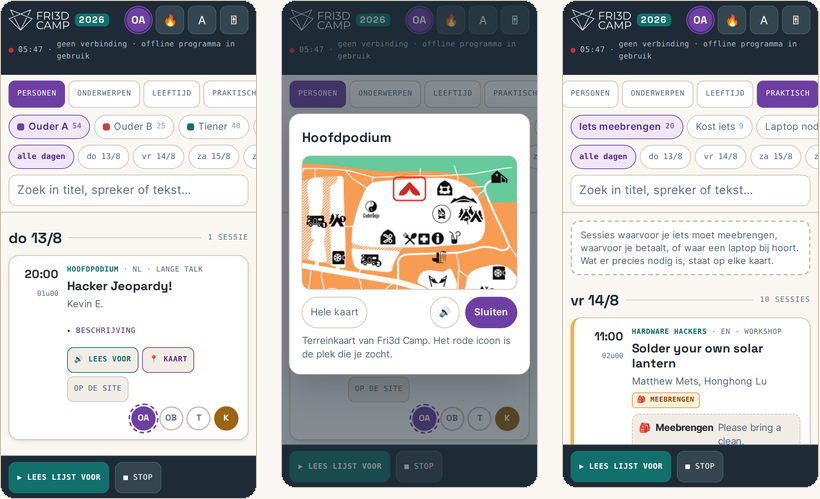
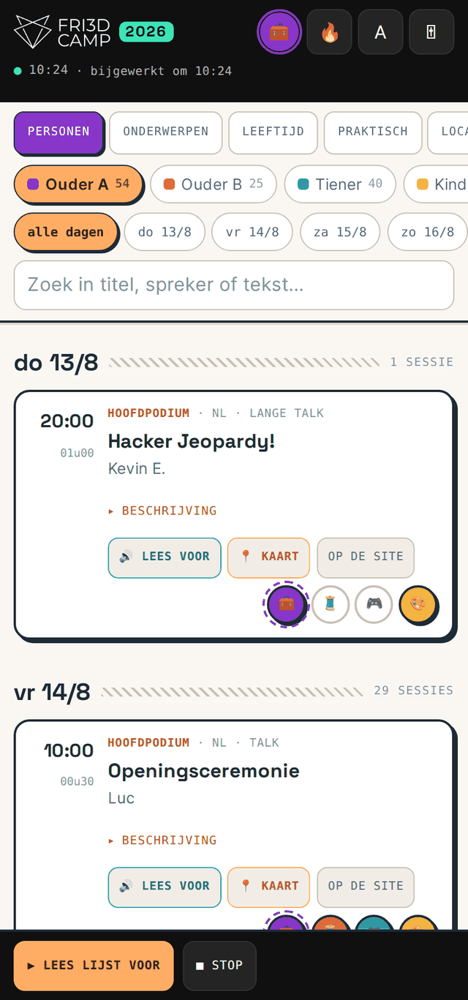
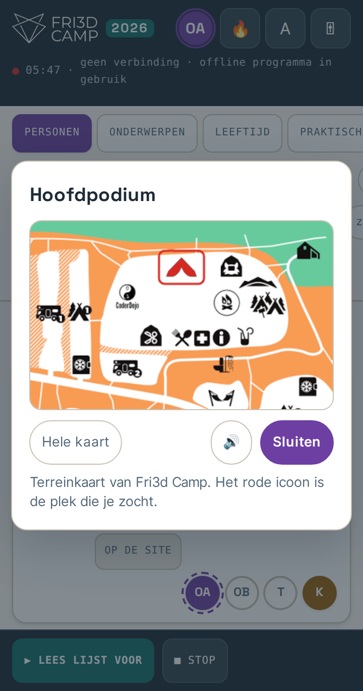
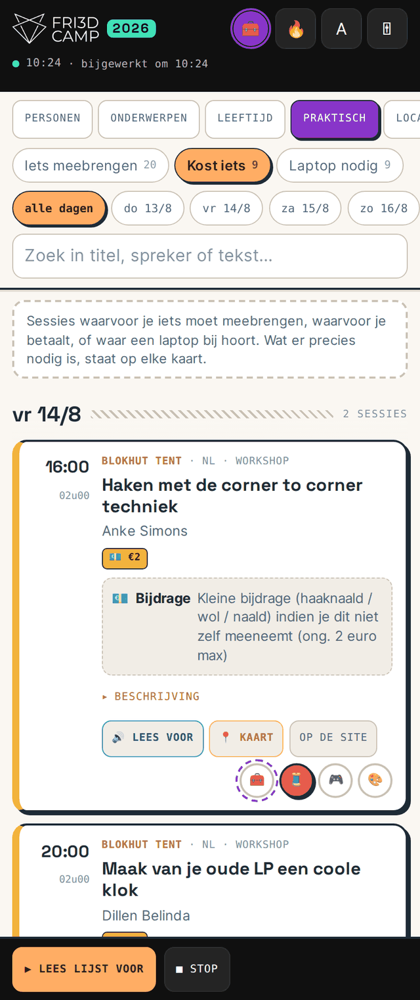
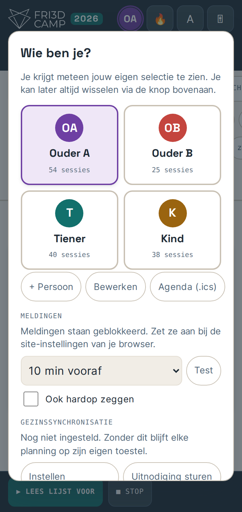
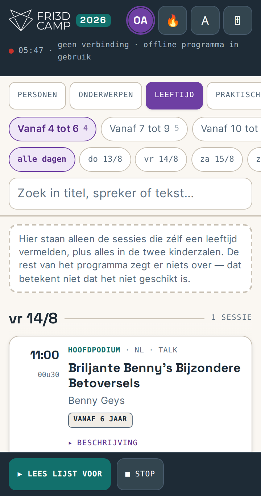
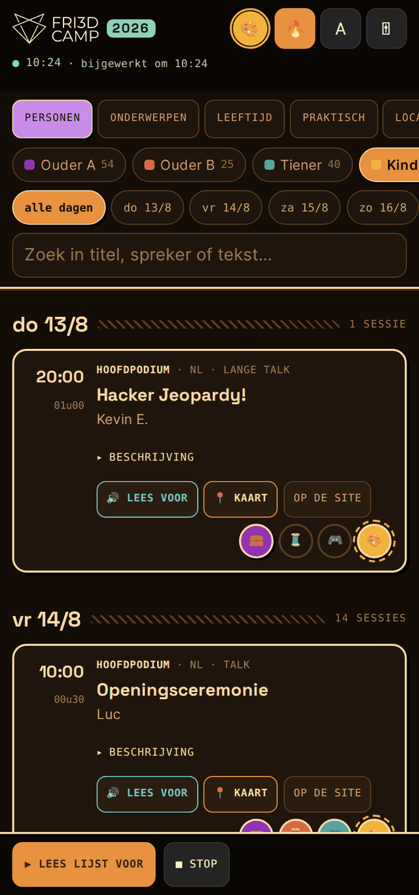
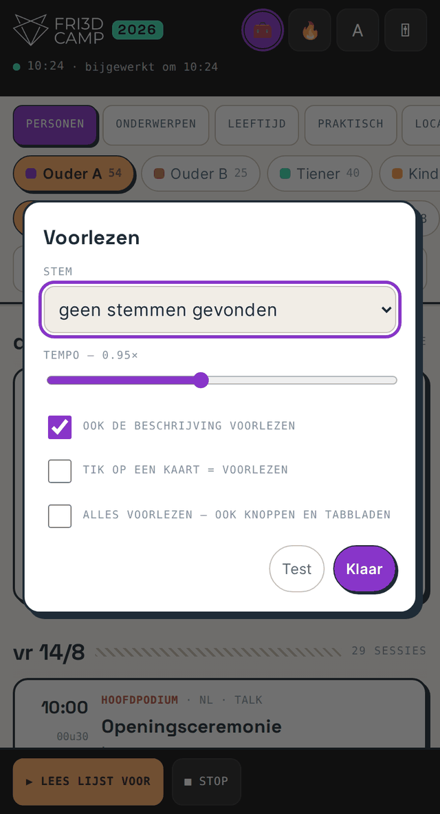
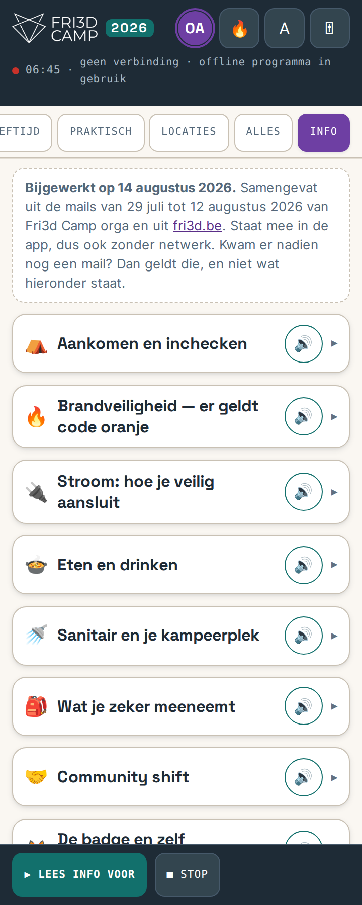

<p align="center">
  
</p>

<h1 align="center">Fri3d Camp — planner</h1>

<p align="center">
  Een offline PWA die het volledige kampprogramma toont, iedereen zijn eigen
  planning geeft, alles kan voorlezen en waarschuwt vlak voor iets begint.
</p>

<p align="center">
  
</p>

<p align="center">
  <a href="LICENSE"></a>
  
  
</p>

---

Een project van **SHiftEDMake**, als ondersteuning voor de deelnemers van
**Fri3d Camp**.

> ### 👉 Nooit eerder een website online gezet?
> Dan is dit bestand niet voor jou geschreven. Begin bij
> **[docs/START-HIER.md](docs/START-HIER.md)** — dat legt alles uit zonder
> jargon, met een woordenlijst, en gaat ervan uit dat je nog nooit van Netlify
> of Supabase gehoord hebt. Twintig minuten en je bent klaar.
>
> Wil je de app gewoon *gebruiken* omdat iemand je een link stuurde? Lees dan
> **[docs/GEBRUIKEN.md](docs/GEBRUIKEN.md)**.
>
> De rest van deze README is voor wie zelf aan de code wil.

## Waarom dit bestaat

Op een maker-kamp loopt iedereen in een ander tempo. De ene wil om acht uur
's ochtends in de Kapel zitten, de andere wil vooral weten wanneer de laserzaal
opengaat, en een derde leest niet vlot genoeg om zich door een raster van
honderdvijftig sessies te worstelen. De officiële programmapagina is prima,
maar toont voor iedereen hetzelfde.

Deze app draait het om: **iedereen zijn eigen lijst**, op zijn eigen toestel,
met een stem erbij als dat helpt, en een por op de schouder tien minuten voor
het begint.

## Voor wie

**Voor jezelf.** Vink aan wat je wil zien, laat de rest vallen. Je krijgt een
lijst die alleen jouw dag toont, met een waarschuwing vooraf en de juiste plek
op de kaart. Verder heb je niets nodig: geen account, geen server, geen
internet op het terrein.

**Voor vrienden die samen willen kiezen.** Stuur je planning door als link of
korte code en laat de ander ze samenvoegen met de zijne. Zo zie je meteen waar
jullie elkaar tegenkomen — en waar niet.

**Voor gezinnen die alles gedeeld willen houden.** Zet één keer de
synchronisatie op, stuur de anderen een uitnodiging, en vanaf dan lopen de vier
planningen vanzelf gelijk. Iedereen bewerkt de zijne, iedereen ziet die van de
rest.

**Voor gezinnen waarvan de kinderen nog geen gsm hebben.** Misschien wel de
reden waarom dit er zo uitziet. Overloop 's ochtends samen met je kinderen wat
ze willen doen, tik het aan onder hun naam, en jij houdt het overzicht: wanneer
de waterraketten de lucht in gaan, waar de flipperkast staat, en dat er om vier
uur nog iets is waar ze naartoe wilden. Zij kiezen, jij mist niets. Wil je het
helemaal zeker spelen, exporteer hun dag dan naar je eigen agenda — dan gaat je
telefoon af, ook als de app dicht is.

## Wat het kan

| | |
|---|---|
| **Tabbladen** | Per persoon, per onderwerp, per leeftijd, per praktische vereiste, per locatie, alles, en Info |
| **Info** | Alles uit de mails van de organisatie op één plek: aankomst, brandveiligheid, stroom, eten, meebrengen, contact — uitklapbaar, met de juiste links, en voorleesbaar |
| **Leeftijd** | Alleen wat de sessies zélf vermelden, plus de twee kinderzalen — geen gokwerk |
| **Praktisch** | Eigen tabblad met 🎒 meebrengen, 💶 kost iets en 💻 laptop nodig, met de letterlijke zin erbij |
| **Eigen planning** | Tik een sessie bij eender wie in of uit; iedereen vertrekt van een voorstel |
| **Personen** | Zelf aanmaken, hernoemen, avatar of foto kiezen, verwijderen |
| **Voorlezen** | Per sessie, hele lijst achter elkaar, of de volledige interface inclusief knoppen |
| **Meldingen** | 5 tot 30 minuten vooraf; sessies die samenvallen worden één bericht |
| **Agenda** | Export naar `.ics` met herinneringen, voor meldingen terwijl de app dicht is |
| **Botsingen** | Toont bij elke sessie met hoeveel andere uit dezelfde planning ze overlapt |
| **Wijzigingen** | Haalt elk uur het programma op en meldt wat verplaatst, geschrapt of nieuw is |
| **Synchronisatie** | Automatisch tussen alle toestellen van het gezin, via je eigen Supabase |
| **Zonder netwerk** | Planningen delen via een korte code of link |
| **Terreinkaart** | Tik op een sessie of locatie: het juiste icoon kleurt rood, op de kaart én in de legende |
| **Kampvuurmodus** | Amberkleurig scherm dat 's avonds je nachtzicht spaart |
| **Offline** | Het volledige programma zit in het bestand; internet is enkel voor updates |

## Zo ziet het eruit

<table>
<tr>
<td width="33%" valign="top">

<sub><b>Je eigen dag.</b> Elke sessie toont uur, zaal, spreker en vier gekleurde
knoppen — één per gezinslid. Eén tik zet iets in of uit hun planning.</sub>
</td>
<td width="33%" valign="top">

<sub><b>Waar is het?</b> Eén kaartbestand; de app kleurt de donkere pixels van
precies dat ene icoon rood, op de kaart én in de legende.</sub>
</td>
<td width="33%" valign="top">

<sub><b>Praktisch.</b> Wat kost geld, wat moet je meebrengen, waar heb je een
laptop bij nodig — met de letterlijke zin uit de beschrijving.</sub>
</td>
</tr>
<tr>
<td valign="top">

<sub><b>Wie ben je?</b> Personen aanmaken, hernoemen, een avatar of foto geven
en verwijderen. Hier zitten ook meldingen, synchronisatie en de agenda-export.</sub>
</td>
<td valign="top">

<sub><b>Leeftijd.</b> Uitsluitend wat de sessies zélf vermelden, plus de twee
kinderzalen. Het kader zegt er eerlijk bij wat er níét in staat.</sub>
</td>
<td valign="top">

<sub><b>Kampvuurmodus.</b> Amber in plaats van blauw licht, zodat je scherm
's avonds niemands nachtzicht sloopt.</sub>
</td>
</tr>
</table>

<table>
<tr>
<td width="50%" valign="top">

<sub><b>Voorlezen.</b> Stem, tempo, en de schakelaar die ook knoppen en tabbladen
uitspreekt zodra je ze aanraakt — voor wie niet vlot leest.</sub>
</td>
<td width="50%" valign="top">

<sub><b>Info.</b> Wat anders in vier mails verspreid zit: aankomst, brandveiligheid,
stroom, eten, contact. Elk blok heeft een eigen voorleesknop.</sub>
</td>
</tr>
</table>

## Snel starten

Je hebt geen buildstap, geen npm en geen server nodig. De `public/`-map ís de
site. *(Stap voor stap, zonder voorkennis: [docs/START-HIER.md](docs/START-HIER.md).)*

### Netlify

1. Fork deze repo.
2. Op [netlify.com](https://netlify.com): **Add new site → Import an existing project**, kies je fork.
3. Publish directory op `public`. Build command leeg laten. `netlify.toml` regelt de rest.
4. Klaar. Open het adres in **Chrome of Safari zelf**, niet in de browser van WhatsApp of Messenger.

Sleep je liever gewoon een map? Dan werkt [drop.netlify.com](https://app.netlify.com/drop):
sleep de inhoud van `public/` erin.

### Vercel

`vercel --cwd public` of via de webinterface met `public` als root directory.

### GitHub Pages

Settings → Pages → Deploy from a branch → `main` / `/docs`. Hernoem `public`
dan naar `docs`, of gebruik een Action die `public/` publiceert.

### Lokaal proberen

```bash
cd public && python3 -m http.server 8080
```

Open `http://localhost:8080`. Let op: een service worker vereist `https` of
`localhost`. Dubbelklikken op `index.html` werkt ook, maar dan kan je de app
niet installeren.

> **Installeren als app.** Zodra de site over https draait, verschijnt in de
> kopbalk een **⤓ App**-knop. Zie je die niet, dan gebruik je een in-app
> browser of is de service worker niet actief — zie [Problemen](#problemen).

## Synchronisatie tussen toestellen

Optioneel. Sla je dit over, dan werkt alles gewoon, maar houdt elk toestel zijn
eigen planning bij en deel je handmatig via een code.

**Wat er gedeeld wordt:** namen, avataremoji's en wie welke sessie in zijn
planning heeft. **Wat niet:** geüploade foto's; die blijven op het toestel waar
je ze koos.

### Eén keer instellen, door één iemand

1. Maak een project op [supabase.com](https://supabase.com). Kies een regio
   dicht bij je (Frankfurt voor de Benelux). Het **databasewachtwoord** dat
   gevraagd wordt is voor rechtstreekse Postgres-verbindingen — de app gebruikt
   het niet. In je wachtwoordmanager ermee en verder vergeten.
2. **SQL Editor** → plak de inhoud van [`supabase/schema.sql`](supabase/schema.sql) → **Run**.
3. **Project Settings → API Keys**: neem de **Publishable key** (`sb_publishable_…`),
   of bij oudere projecten de **anon** key (`eyJ…`). Neem *nooit* de secret- of
   service_role-key: die omzeilt row level security.
4. Kopieer ook de **Project URL** (`https://xxxx.supabase.co`), zonder `/rest/v1` erachter.
5. In de app: profielknop → **Gezinssynchronisatie → Instellen**. Plak URL en
   key, laat de groepscode staan of genereer een nieuwe, klik **Testen** en dan
   **Bewaren**.

### De rest van het gezin

Profielknop → **Uitnodiging sturen**. Die link bevat URL, key en groepscode.
Zij openen hem één keer, kiezen hun naam, en verder hoeft niemand nog iets.

Vanaf dan wordt er opgehaald bij het openen, bij elke keer terugschakelen naar
de app, elke 45 seconden zolang ze zichtbaar is, en zodra het toestel weer
online komt. Aanpassingen gaan anderhalve seconde na je laatste tik omhoog.

**Botsingen** worden per persoon opgelost: wie het laatst iets aan die persoon
wijzigde, wint. Je kan dus de lijst van je kind samenstellen terwijl het zelf
aan de zijne werkt, zonder elkaar te overschrijven — tenzij jullie exact dezelfde persoon
tegelijk aanpassen.

### Hoe veilig is dit?

Eerlijk antwoord: **de groepscode is het enige geheim**. De tabel staat open
voor lezen en schrijven door iedereen met de link. Voor een gezinsplanning is
dat een prima afweging; zet er niets in wat je niet aan een vreemde zou tonen,
en plak de uitnodigingslink niet in een groepschat met honderd man.

Wil je het strakker? Voeg een `check (group_id = current_setting(...))` toe of
zet Supabase Auth met magic links ervoor. Dat valt buiten deze versie.

Na het kamp opruimen:

```sql
delete from fri3d_plans where group_id = 'jouwgroep-xxxxxx';
```

## De terreinkaart

Bij elke sessie staat een **📍 Kaart**-knop, en boven een locatietabblad een balk
"Toon … op de kaart". Wat je krijgt is de gewone Fri3d-kaart met precies één
icoon in het rood — ook het bijhorende icoon in de legende, zodat je meteen ziet
waar je naar zoekt.

Er is maar **één** kaartbestand. De app tekent het op een canvas en vervangt de
donkere pixels binnen één icoonvakje door rood. Geen twintig varianten dus, en
het werkt offline.

De vakjes staan in [`build/mapcoords.json`](build/mapcoords.json):

```json
"Kapel": { "m": [623,420,29,45], "l": [815,519,30,46], "n": "Kapel" }
```

`m` is het vakje op de kaart, `l` dat in de legende, `n` de naam die je toont.
Alle vier de waarden zijn `[x, y, breedte, hoogte]` in pixels van het
originele kaartbestand; `size` bovenaan zegt hoe groot dat is.

**Een eigen kaart gebruiken.** Vervang `public/kaart.png`, zet `size` goed en
meet de vakjes op. Handmatig kan, maar de coördinaten in deze repo zijn
gevonden door de legende-iconen met vormvergelijking terug te zoeken op de
kaart — dat scheelt veel turen. Een zaal zonder vermelding in `rooms` krijgt
gewoon geen kaartknop; er gaat niets stuk.

## Voor een ander kamp of evenement

De app leest een **Pretalx**-export. Draait jouw evenement op Pretalx, dan is
aanpassen een kwestie van twee waarden.

1. Haal het rooster op:
   ```bash
   curl -o build/schedule-snapshot.json \
     "https://jouw-pretalx/JOUWEVENT/schedule/export/schedule.json"
   ```
2. In `build/app.template.html`: zet `SRC` op diezelfde URL.
3. In `build/build.py`: pas het `TAG`-woordenboek aan. Elke sleutel is een stuk
   tekst uit een sessietitel, elke waarde een lijst labels. Personen en thema's
   deel je hetzelfde mechanisme; `PEOPLE` en `THEMES` bepalen welke labels als
   tabblad verschijnen.
   Ook de labels voor meebrengen, kosten en laptop worden uit de tekst gehaald.
   De extractie is bewust streng: liever een gemist label dan een verkeerd. Zinnen
   waarin de begeleider zelf materiaal meebrengt ("ik breng de wol mee") worden
   apart gezet onder *Wordt voorzien*, niet onder *Meebrengen*.

   Leeftijdslabels worden automatisch afgeleid uit zinnen als "vanaf 8 jaar" of
   "minimumleeftijd van dertien"; sessies die er niets over zeggen krijgen geen
   label. Het script drukt af hoeveel er in elke leeftijdsgroep terechtkwamen.

4. Bouwen:
   ```bash
   cd build && python3 build.py
   ```
   Dat schrijft `public/index.html`. Er is geen andere buildstap; alle data zit
   in dat ene bestand.

Het script drukt af welke sessies geen enkel label kregen, zodat je niets over
het hoofd ziet.

Geen Pretalx? Vervang dan de functie `flatten()` in de template en de leeslus in
`build.py`; alles daarna werkt op een eenvoudige lijst met velden voor datum,
uur, duur, zaal, titel, sprekers, taal en beschrijving.

### Het tabblad Info aanpassen

De kampinformatie staat als één lijst `INFO` bovenaan de renderfuncties in
`build/app.template.html`. Elk blok is `{i, t, l, k}`: een emoji, een titel, een
lijst zinnen, en een lijst links als `["tekst", "url"]`. Voeg een blok toe of
haal er een weg, bouw opnieuw, klaar — de voorleesknoppen en de knop *Lees info
voor* volgen vanzelf.

Zet er `INFO_BIJGEWERKT` en `INFO_BRON` boven op de juiste waarde. Die twee
verschijnen in het kader bovenaan het tabblad en in de gesproken inleiding, zodat
een deelnemer meteen ziet tot wanneer de informatie loopt. Vergeet je dat, dan
staat er met evenveel stelligheid iets van vorige maand.

Twee dingen om in gedachten te houden. Schrijf **volle zinnen**: ze worden ook
hardop voorgelezen, dus "vanaf 15u" wordt beter "vanaf 15 uur". En zet er nooit
links uit een nieuwsbrief in: die lopen doorgaans via een tracker en bevatten
het e-mailadres van de ontvanger. Zoek de echte bestemming op.

## Vormgeving

De vormgeving is die van **SHiftEDMake**: navy inkt op warm papier, Space
Grotesk voor koppen, Inter voor lopende tekst. Sinds 1.1.0 leent de app niets
meer van de huisstijl van Fri3d Camp — dat is bewust, zodat meteen duidelijk is
dat dit een project ernaast is en niet de officiële app.

| | |
|---|---|
| Papier `#FAF7F2` · inkt `#1E2B36` | de basis; balken boven en onder dragen dezelfde navy |
| Paars `#6E3FA3`, inkt `#5A2E88` | selectie, links, focusring — alles wat "jij koos dit" betekent |
| Teal `#12706C` | bevestiging: de zaal, voorlezen, nieuwe sessies, synchronisatie in orde |
| Amber `#F2B33D` | let op: kosten, voorbereiding |
| Rood `#C8322A` | wat nu bezig is, en wat geschrapt werd |

Kaarten en knoppen staan op een zachte schaduw en een dunne warme rand, geen
harde offset. Scheidingen zijn haarlijnen. De acht persoonskleuren zijn dieper
gekozen dan vroeger, zodat de witte initiaal in elke avatar leesbaar blijft;
dezelfde kleur zie je terug in de chip, de avatar en de planningsknop, zodat je
nooit hoeft te lezen wie waar staat.

> De vier ingebouwde personen heten Ouder A, Ouder B, Tiener en Kind. Dat is
> alles wat in de code staat — de namen die jij invult, blijven op je eigen
> toestel.

De monospace is er voor de geeky details: uren, zalen, tellers, statusregels.
Inhoud in Inter, machinerie in mono.

**Toegankelijkheid is nagerekend, niet gehoopt.** Alle tekstcombinaties halen
WCAG AA, in beide standen: 13,5:1 voor lopende tekst, 4,7:1 voor de kleinste
labels — dat laatste is meteen de laagste waarde in de hele app. Tikdoelen zijn
minstens 44 pixels, de focusring is 3 pixels paars en overal zichtbaar,
`prefers-reduced-motion` wordt gerespecteerd, en de statusregel is een
`role="status"` zodat schermlezers wijzigingen meekrijgen. De lettertypen staan
lokaal in `public/fonts/`, dus offline ziet alles er hetzelfde uit.

## Hoe het in elkaar zit

```
docs/              handleidingen voor niet-technische gebruikers
  START-HIER.md    de app online zetten, zonder voorkennis
  GEBRUIKEN.md     de app dagelijks gebruiken
  screenshots/     schermafbeeldingen voor deze README en de handleiding
public/            de volledige site — hier staat alles wat je deployt
  index.html       de app, met het programma erin gebakken (± 160 kB)
  sw.js            service worker: offline shell en meldingsklikken
  manifest.json    installatiegegevens
  icon*.png/svg    het vossenlogo van Fri3d
  shiftedmake-logo.png  het logo in de voettekst
  kaart.png        de terreinkaart
  fonts/           Space Grotesk en Inter (OFL)
.github/workflows/
  build-check.yml  controleert of index.html uit de template gebouwd is
build/
  build.py         labelt de sessies en giet ze in de template
  app.template.html  de app zonder data
  schedule-snapshot.json  het opgehaalde programma
supabase/schema.sql  tabel en policies voor de synchronisatie
```

Drie ontwerpkeuzes die verklaren waarom het zo simpel blijft:

**Eén bestand.** Geen framework, geen bundler, geen afhankelijkheden. Het
programma zit als JSON in de HTML. Daardoor werkt de app meteen offline en kan
je hem gewoon als bestand doorsturen.

**De planning is een verschil, geen lijst.** Er wordt enkel opgeslagen wat je
*toevoegde* en wat je *weghaalde* ten opzichte van het voorstel. Daarom past een
gedeelde planning in een link van een paar tientallen tekens.

**Sessies worden geïdentificeerd door hun URL plus datum**, niet door hun uur.
Verplaatst de organisatie iets, dan blijft het in je planning staan en zie je de
verplaatsing in de wijzigingsbanner.

## Automatisch bijwerken

### Netlify zet elke push online

Koppel je de repo één keer aan Netlify (*Add new site → Import an existing
project*, of bij een bestaande site *Site configuration → Build & deploy → Link
repository*), dan wordt elke push naar `main` vanzelf gepubliceerd.

Je hoeft daar niets voor in te stellen: `netlify.toml` zegt al dat `public/` de
site is en dat er geen buildcommando nodig is. Pull requests krijgen er gratis
een deploy preview bij, op een eigen adres, voor je ze samenvoegt.

De service worker zit niet in de weg. `netlify.toml` zet `Cache-Control:
no-cache` op `sw.js`, `manifest.json` en `index.html`, zodat een bezoeker de
nieuwe versie krijgt in plaats van de gecachete oude.

### De controle die daarbij hoort

Automatisch deployen legt een valkuil bloot die er zonder Netlify ook al was,
maar dan zonder gevolgen. `public/index.html` is **gegenereerd**. Pas je
`build/app.template.html` of `build/build.py` aan en vergeet je

```bash
cd build && python3 build.py
```

te draaien, dan publiceert Netlify braaf de oude app. Geen foutmelding, geen
rode vlag — je wijziging is er gewoon niet, en je zoekt je een breuk.

Daarom draait bij elke push en elke pull request
[`.github/workflows/build-check.yml`](.github/workflows/build-check.yml). Die
bouwt de app opnieuw uit de template en vergelijkt het resultaat met wat er in
de repo staat. Verschilt er iets, dan faalt de controle met de commando's om het
recht te zetten erbij.

Het is een leescontrole: `permissions: contents: read`, geen secrets, en er wordt
niets gedeployd of teruggeschreven. De build is deterministisch en gebruikt geen
netwerk — alle gegevens zitten in `build/schedule-snapshot.json` — dus dezelfde
invoer geeft altijd hetzelfde bestand.

> **Zet hem als vereiste in.** Settings → Branches → Add branch protection rule
> voor `main`, en vink de controle aan bij *Require status checks to pass*. Dan
> kan een pull request met een vergeten rebuild niet meer binnengeraken.

Regeleindes zijn geen probleem: `.gitattributes` normaliseert alles naar LF in de
repo, dus een build op Windows en een build op de Linux-runner geven hetzelfde
resultaat.

## Toegankelijkheid

Dit begon als hulpmiddel voor iemand die niet vlot leest, en dat stuurt het
ontwerp.

- **Alles voorlezen** (instellingen → Voorlezen) spreekt ook knoppen, tabbladen
  en schakelaars uit zodra je erop tikt. Je hoort waar je op drukt.
- **Tik op een kaart = voorlezen** maakt van elke sessie een luisterbare tekst.
- De meldingen kunnen **hardop** worden uitgesproken.
- De **A**-knop vergroot letters en regelafstand.
- Stem, tempo en het al dan niet meelezen van de beschrijving zijn instelbaar;
  Vlaamse stemmen krijgen voorrang.
- Kaarten die voorgelezen worden krijgen een rand en scrollen in beeld.
- Zichtbare toetsenbordfocus; `prefers-reduced-motion` wordt gerespecteerd.

## Problemen

**Geen ⤓ App-knop en geen installatieoptie.** Je zit in een in-app browser
(WhatsApp, Messenger, Instagram). Open de link in Chrome of Safari zelf. Blijft
het weg, dan is de service worker niet actief: harde herlaadbeurt, of wis de
sitegegevens via ⋮ → Instellingen → Site-instellingen.

**`gezin ✗ 404`.** De tabel wordt niet gevonden. Loop na: staat `fri3d_plans`
echt in de Table Editor van hetzelfde project als de URL die je invulde; staat
`public` bij Project Settings → API in de exposed schemas; en voer daarna
`notify pgrst, 'reload schema';` uit.

**`gezin ✗ 401`.** Verkeerde key. **403** betekent meestal dat je de secret- in
plaats van de publishable key nam.

**`gezin ✓ (tabel mist label/avatar)`.** Je draait nog het oude schema. Voer
`supabase/schema.sql` opnieuw uit; de `alter table`-regels vullen aan wat
ontbreekt.

**Geen meldingen.** Toestemming geweigerd? Zet ze terug aan bij de
site-instellingen van je browser. En weet dat een PWA niets kan melden terwijl
ze volledig gesloten is — gebruik daarvoor de `.ics`-export.

**Het programma laadt niet bij.** De browser mag Fri3d misschien niet
rechtstreeks aanspreken; de app valt dan terug op een proxy en anders op de
ingebakken versie. De statusregel zegt wanneer er laatst iets binnenkwam.

**Voorlezen zwijgt.** Sommige mobiele browsers spreken pas na een echte tik.
Druk één keer op **Lees voor** bij een sessie; daarna werkt ook het automatisch
voorlezen.

## Meedoen

Pull requests zijn welkom, zeker voor: andere Pretalx-evenementen, betere
labels, toegankelijkheidsverbeteringen en vertalingen. Houd het bij vanilla
JavaScript zonder afhankelijkheden — dat is bewust.

Lees eerst [`CONTRIBUTING.md`](CONTRIBUTING.md): daar staat hoe je bouwt, wat er
nagekeken wordt en waarom je `build/app.template.html` bewerkt en niet
`public/index.html`. Verder gelden [`CODE_OF_CONDUCT.md`](CODE_OF_CONDUCT.md) en,
voor beveiligingsproblemen, [`SECURITY.md`](SECURITY.md) — meld die privé, niet
in een publiek issue.

## Licentie

Code onder de **MIT-licentie** (`LICENSE`). Daarbuiten vallen: het
**SHiftEDMake-logo en de naam** (van Serge Hanssens), en het **vossenlogo, de
terreinkaart en de programmagegevens** (van Fri3d Camp). Zie
[`NOTICE.md`](NOTICE.md). Fork je dit onder je eigen naam, vervang dan beide
beeldmerken en de voettekst. De lettertypen staan onder de SIL Open Font License.

Programmagegevens, de terreinkaart en het vossenlogo komen van
[Fri3d Camp](https://fri3d.be) en blijven van hen en van de sprekers; ze worden
hier met toestemming gebruikt.

<p align="center"><sub>Een project van <a href="https://shiftedmake.com">SHiftEDMake</a>, als ondersteuning voor de deelnemers van <a href="https://fri3d.be">Fri3d Camp</a> — omdat iedereen zijn eigen programma verdient.</sub></p>
